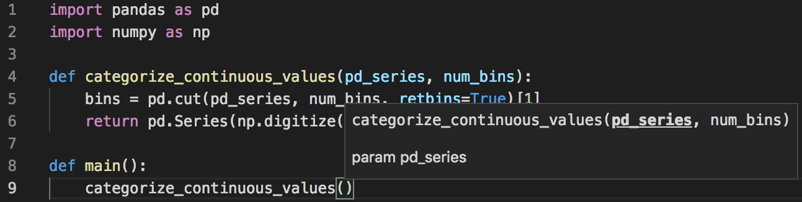
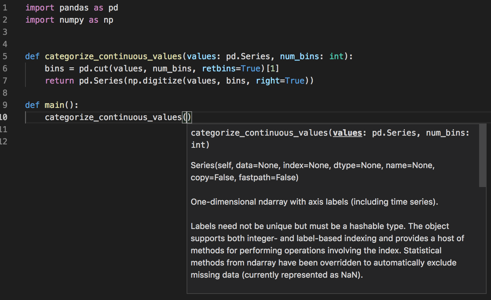

# clean-code-ml

TODO:
- Rearrange README to match outline
- Add links to outline

## Table of Contents
- [Introduction](#introduction)
- [Variables](#variables)
    - Variable names should reveal intent
    - Use meaningful and pronounceable variable names
    - Use the same vocabulary for the same type of variable
    - Avoid magic numbers and magic strings
    - Use variables to keep code "DRY"  ("Don't Repeat Yourself")
    - Use explanatory variables
    - Avoid mental mapping
    - Don't add unneeded context
- [Functions](#functions)
    - Use functions to keep code "DRY"
    - Functions should do one thing
    - Functions should only be one level of abstraction
    - Function names should say what they do
    - Use type hints to improve readability
    - Avoid side effects
    - Avoid unexpected side effects on values passed as function parameters
    - Function arguments (2 or fewer ideally)
    - Use default arguments instead of short circuiting or conditionals
    - Don't use flags as function parameters
- [Dispensables](#todo)
    - Avoid comments
    - Remove dead code
    - Avoid print statements (even glorified print statements such as df.head(), df.describe(), df.plot())
- [Design](#todo)
    - Set boundaries (Keep implementation details hidden). When implementation details are all laid bare in the notebook without any abstractions (functions), we are forced to understand the how's in order to know what's happening
    - Shotgun surgery. When you want to change one thing, you end up having to make changes in many places

## Introduction

Clean code practices (from [Clean Code](https://www.amazon.com/Clean-Code-Handbook-Software-Craftsmanship/dp/0132350882) and [Refactoring](https://www.amazon.com/Refactoring-Improving-Existing-Addison-Wesley-Signature/dp/0134757599)) adapted for machine learning / data science workflows in Python. This is not a style guide. It's a guide to producing
readable, reusable, and refactorable software.

If you'd like to try out these practices, we've created a [refactoring exercise](./refactoring-exercise.md) which you can follow along. Starting with a jupyter notebook with many code smells, you can apply these clean code principles and refactor it to be readable and maintainable. The sample final solution can be found in [`src/train.py`](src/train.py).

Targets Python3.7+

Inspired by [clean-code-javascript](https://github.com/ryanmcdermott/clean-code-javascript) and forked from [clean-code-python](https://github.com/zedr/clean-code-python).

## **Variables**

### Variable names should reveal intent
We will read more code than we will ever write. It's important for our code to express intent so that our readers don't have to waste mental effort to figure out puzzles. 

One common culprit in data science code is dataframes. Every dataframe is named as `df`. In software programming, it's an unusual (and bad) practice to embed information about variable types in the variable name (e.g. we would probably never write `string = 'Hello friends'`. Instead, we would write `greeting = 'Hello friends'`). 

**Bad:**

```python
df = pd.read_csv('loans.csv')

_df = df.groupby(['month']).sum()
__df = filter_loans(_df, month=12)

# let's try to calculate total loan amount for december
total_loan_amount = __df... # wait, should I use df, _df or __df?
```

**Good**:
One rule of thumb on how to name dataframes is to think about what is in each row. For instance, if each row in my dataframe is a loan, then the dataframe is a **collection of loan entries**. Hence, we could call the dataframe `loans`.

```python
loans = pd.read_csv('loans.csv')

monthly_loans = loans.groupby(['month']).sum()
monthly_loans_in_december = filter_loans(monthly_loans, month=12)

# let's try to calculate total loan amount for december
total_loan_amount = monthly_loans_in_december.sum()

```
**[⬆ back to top](#table-of-contents)**

### Use meaningful and pronounceable variable names

**Bad:**

```python
ymdstr = datetime.date.today().strftime("%y-%m-%d")
```

**Good**:

```python
current_date: str = datetime.date.today().strftime("%y-%m-%d")
```
**[⬆ back to top](#table-of-contents)**

### Use the same vocabulary for the same type of variable

**Bad:**
Here we use three different names for the same underlying entity:
```python
get_user_info()
get_client_data()
get_customer_record()
```

**Good**:
If the entity is the same, you should be consistent in referring to it in your functions:
```python
get_user_info()
get_user_data()
get_user_record()
```

### Avoid magic numbers and magic numbers

**Bad:**

```python
# What the heck is 86400 for?
time.sleep(86400);
```

**Good**:

```python
# Extract magic number as a variable
SECONDS_IN_A_DAY = 86400

time.sleep(SECONDS_IN_A_DAY)
```
**[⬆ back to top](#table-of-contents)**

### Use variables to keep code "DRY"  ("Don't Repeat Yourself")
DRY stands for "Don't Repeat Yourself". If you find yourself changing the same thing in multiple places, then that thing which you're changing is a candidate for refactoring.

**Bad:**
Notice how `amount` is duplicated in multiple places. If the column name in the data should change (e.g. to `literally_anything`), then we would need to waste effort in finding and replacing `amount` in multiple places.

```python
loans = loans.fillna({'amount': 0})
loans.groupby(['amount']).mean().sort_values(by='amount')
```

**Good**:
Now, should the `amount` column need to be changed, we can change it in one place:

```python
target_column = 'amount'

loans = loans.fillna({target_column: 0})
loans.groupby([target_column]).mean().sort_values(by=target_column)
```
**[⬆ back to top](#table-of-contents)**

### Use explanatory variables
**Bad:**

```python
address = 'One Infinite Loop, Cupertino 95014'
city_zip_code_regex = r'^[^,\\]+[,\\\s]+(.+?)\s*(\d{5})?$'
matches = re.match(city_zip_code_regex, address)

save_city_zip_code(matches[1], matches[2])
```

**Not bad**:

It's better, but we are still heavily dependent on regex.

```python
address = 'One Infinite Loop, Cupertino 95014'
city_zip_code_regex = r'^[^,\\]+[,\\\s]+(.+?)\s*(\d{5})?$'
matches = re.match(city_zip_code_regex, address)

city, zip_code = matches.groups()
save_city_zip_code(city, zip_code)
```

**Good**:

Decrease dependence on regex by naming subpatterns.
```python
address = 'One Infinite Loop, Cupertino 95014'
city_zip_code_regex = r'^[^,\\]+[,\\\s]+(?P<city>.+?)\s*(?P<zip_code>\d{5})?$'
matches = re.match(city_zip_code_regex, address)

save_city_zip_code(matches['city'], matches['zip_code'])
```
**[⬆ back to top](#table-of-contents)**

### Avoid mental mapping
Don’t force the reader of your code to translate what the variable means.
Explicit is better than implicit.

**Bad:**

```python
seq = ('Austin', 'New York', 'San Francisco')

for item in seq:
    do_stuff()
    do_some_other_stuff()
    # ...
    # Wait, what's `item` for again?
    dispatch(item)
```

**Good**:

```python
locations = ('Austin', 'New York', 'San Francisco')

for location in locations:
    do_stuff()
    do_some_other_stuff()
    # ...
    dispatch(location)
```
**[⬆ back to top](#table-of-contents)**


### Don't add unneeded context

If your class/object name tells you something, don't repeat that in your variable name.

**Bad:**

```python
class Car:
    car_make: str
    car_model: str
    car_color: str

# usage:
car = Car()
car.car_make
car.car_model
car.car_color
```

**Good**:

```python
class Car:
    make: str
    model: str
    color: str

# usage
car = Car()
car.make
car.model
car.color
```

## **Functions**

### Use functions to keep code "DRY"

The developer who learns to recognize duplication, and understands how to eliminate it through proper abstraction (i.e. defining the right functions or methods), can produce much cleaner code than one who continuously infects the application with unnecessary repetition.

Every line of code that goes into an application must be maintained, and is a potential source of future bugs. Duplication needlessly bloats the codebase, resulting in more opportunities for bugs and adding accidental complexity to the system. The bloat that duplication adds to the system also makes it more difficult for developers working with the system to fully understand the entire system, or to be certain that changes made in one location do not also need to be made in other places that duplicate the logic they are working on. DRY requires that "every piece of knowledge must have a single, unambiguous, authoritative representation within a system."

[Source: 97 Things Every Programmer Should Know](https://97-things-every-x-should-know.gitbooks.io/97-things-every-programmer-should-know/content/en/thing_30/)

**Bad:**

```python
decision_tree_model = DecisionTreeClassifier()
decision_tree_model.fit(X_train, Y_train)
Y_pred = decision_tree_model.predict(X_test)
decision_tree_accuracy = round(decision_tree_model.score(X_train, Y_train) * 100, 2)
print(decision_tree_accuracy)

random_forest_model = RandomForestClassifier(n_estimators=100)
random_forest_model.fit(X_train, Y_train)
Y_pred = random_forest_model.predict(X_test)
random_forest_model.score(X_train, Y_train)
random_forest_accuracy = round(random_forest_model.score(X_train, Y_train) * 100, 2)
print(random_forest_accuracy)

gaussian_model = GaussianNB()
gaussian_model.fit(X_train, Y_train)
Y_pred = gaussian_model.predict(X_test)
gaussian_accuracy = round(gaussian_model.score(X_train, Y_train) * 100, 2)
print(gaussian_accuracy)
```

**Good**:

```python
def train_model(ModelClass, X_train, Y_train, **kwargs):
    model = ModelClass(**kwargs)
    model.fit(X_train, Y_train)
    
    accuracy_score = round(model.score(X_train, Y_train) * 100, 2)
    print(f'accuracy ({ModelClass.__name__}): {accuracy_score}')
    
    return model, accuracy_score

decision_tree_model, decision_tree_accuracy = train_model(DecisionTreeClassifier, X_train, Y_train)
random_forest_model, random_forest_accuracy = train_model(RandomForestClassifier, X_train, Y_train, n_estimators=100)
gaussian_model     , gaussian_accuracy      = train_model(GaussianNB, X_train, Y_train)
```

**Tip**: Notice how the symmetry of the 3 code blocks in the bad example made it easier for us to identify and refactor the duplicated code? One useful practice in eliminating duplication is to **first make the duplication as obvious as possible**. This makes it easier for us to identify opportunities for extracting the duplication into their appropriate homes.

### Functions should do one thing
This is by far the most important rule in software engineering. When functions do more than one thing, they are harder to compose, test, and reason about. When you can isolate a function to just one action, they can be refactored easily and your code will read much cleaner. If you take nothing else away from this guide other than this, you'll be ahead of many developers.

**Bad:**

```python

def email_clients(clients: List[Client]):
    """Filter active clients and send them an email.
    """
    for client in clients:
        if client.active:
            email(client)
```

**Good**:

```python
def get_active_clients(clients: List[Client]) -> List[Client]:
    """Filter active clients.
    """
    return [client for client in clients if client.active]


def email_clients(clients: List[Client, ...]) -> None:
    """Send an email to a given list of clients.
    """
    for client in clients:
        email(client)
```

Do you see an opportunity for using generators now?

**Even better**
```python
def active_clients(clients: List[Client]) -> Generator[Client]:
    """Only active clients.
    """
    return (client for client in clients if client.active)


def email_client(clients: Iterator[Client]) -> None:
    """Send an email to a given list of clients.
    """
    for client in clients:
        email(client)
```

**[⬆ back to top](#table-of-contents)**

### Functions should only be one level of abstraction

When you have more than one level of abstraction, your function is usually doing too much. Splitting up functions leads to reusability and easier testing.

**Bad:**

```python
def parse_better_js_alternative(code: str) -> None:
    regexes = [
        # ...
    ]

    statements = regexes.split()
    tokens = []
    for regex in regexes:
        for statement in statements:
            # ...

    ast = []
    for token in tokens:
        # Lex.

    for node in ast:
        # Parse.
```

**Good:**

```python
def parse_better_js_alternative(code: str) -> None:
    tokens = tokenize(code)
    syntax_tree = parse(tokens)

    for node in syntax_tree:
        # Parse.


def tokenize(code: str) -> list:
    REGEXES = [
        # ...
    ]

    statements = code.split()
    tokens = []
    for regex in REGEXES:
        for statement in statements:
           # Append the statement to tokens.

    return tokens


def parse(tokens: list) -> list:
    syntax_tree = []
    for token in tokens:
        # Append the parsed token to the syntax tree.

    return syntax_tree
```

**[⬆ back to top](#table-of-contents)**

### Function names should say what they do

**Bad:**

```python
class Email:
    def handle(self) -> None:
        # Do something...

message = Email()
# What is this supposed to do again?
message.handle()
```

**Good:**

```python
class Email:
    def send(self) -> None:
        """Send this message.
        """

message = Email()
message.send()
```

**[⬆ back to top](#table-of-contents)**

### Use type hints to improve readability

Using type hints can make your code more readable and reasonable. 
Your development experience will also be improved because your IDE will be able to give you better auto-complete suggestions about function/method names and parameters.

**Bad:**

Without type hints, we are forced to embed type information in variable names (e.g. `pd_series`). This can make variable names unnecessarily long. Also, our IDE is not able to give us auto-complete hints, and as a result, we have to hop to the source file to find out what parameters this function accepts.



**Good**:

With type hints, we can name our variables sensibly, and the IDE now offers better autocompletion and make us more productive and less error-prone.



It's important to note that type hints are meant to be entirely ignored by the Python runtime, and are checked only by 3rd party tools like `mypy` and Pycharm's integrated checker. You can read more about type hints and how to use type checkers [here](https://www.bernat.tech/the-state-of-type-hints-in-python/). 

**[⬆ back to top](#table-of-contents)**

### Avoid side effects

A function produces a side effect if it does anything other than take a value in and return another value or values. For example, a side effect could be writing to a file, modifying some global variable, or accidentally wiring all your money to a stranger.

Now, you do need to have side effects in a program on occasion - for example, like in the previous example, you might need to write to a file. In these cases, you should centralize and indicate where you are incorporating side effects. Don't have several functions and classes that write to a particular file - rather, have one (and only one) service that does it.

The main point is to avoid common pitfalls like sharing state between objects without any structure, using mutable data types that can be written to by anything, or using an instance of a class, and not centralizing where your side effects occur. If you can do this, you will be happier than the vast majority of other programmers.

**Bad:**

```python
# Global variable referenced by following function.
# If another function used this name, now it'd be an array and could break.
name = 'Ryan McDermott'

def split_into_first_and_last_name() -> None:
    global name
    name = name.split()

split_into_first_and_last_name()
print(name)  # ['Ryan', 'McDermott']

# calling this function the second time will throw AttributeError: 'list' object has no attribute 'split'
split_into_first_and_last_name()
```

**Good:**

```python
def split_into_first_and_last_name(name: str) -> None:
    return name.split()

name = 'Ryan McDermott'
new_name = split_into_first_and_last_name(name)

print(name)  # 'Ryan McDermott'
print(new_name)  # ['Ryan', 'McDermott']
```

**[⬆ back to top](#table-of-contents)**

### Avoid unexpected side effects on values passed as function parameters

We can unexpectedly change the values passed to our functions, even though our functions appear to be pure. 

This will happen when we pass non-primitive objects (e.g. lists, dictionaries, instances of classes, pandas dataframes) to a function because in Python (and indeed many other languages), non-primitive objects are [passed by reference](https://twitter.com/ericlbarnes/status/1138528829692174337). 

**Bad:**

```python
import pandas as pd

original = pd.DataFrame({
    'values': [1,2,3],
})

def multiply_column_by_10(df, column_name):
    df['multiplied column'] = df[column_name] * 10
    
    return df
    
new = multiply_column_by_10(original, 'values')

original.head() # surprise! original dataframe is mutated and now it has
```

**Good:**

```python
import pandas as pd

original = pd.DataFrame({
    'values': [1,2,3],
})

def multiply_column_by_10(df, column_name):
    df = df.copy()
    df['multiplied column'] = df[column_name] * 10
    
    return df
    
new = multiply_column_by_10(original, 'values')

original.head() # original dataframe is not mutated
```

### Function arguments (2 or fewer ideally)
Limiting the amount of function parameters is incredibly important because it makes  testing your function easier. Having more than three leads to a combinatorial explosion  where you have to test tons of different cases with each separate argument.

One or two arguments is ok, and three should be avoided. Anything more than that should be consolidated. Usually, if you have more than two arguments then your function is trying to do too much. In cases where it's not, most of the time a higher-level object will suffice as an argument.

**Bad:**

```python
def create_menu(title, body, button_text, cancellable):
    # ...
```

**Good**:

```python
class Menu:
    def __init__(self, config: dict):
        title = config["title"]
        body = config["body"]
        # ...

menu = Menu(
    {
        "title": "My Menu",
        "body": "Something about my menu",
        "button_text": "OK",
        "cancellable": False
    }
)
```

**Also good**
```python
class MenuConfig:
    """A configuration for the Menu.

    Attributes:
        title: The title of the Menu.
        body: The body of the Menu.
        button_text: The text for the button label.
        cancellable: Can it be cancelled?
    """
    title: str
    body: str
    button_text: str
    cancellable: bool = False


def create_menu(config: MenuConfig):
    title = config.title
    body = config.body
    # ...


config = MenuConfig
config.title = "My delicious menu"
config.body = "A description of the various items on the menu"
config.button_text = "Order now!"
# The instance attribute overrides the default class attribute.
config.cancellable = True

create_menu(config)
```

**Fancy**
```python
from typing import NamedTuple


class MenuConfig(NamedTuple):
    """A configuration for the Menu.

    Attributes:
        title: The title of the Menu.
        body: The body of the Menu.
        button_text: The text for the button label.
        cancellable: Can it be cancelled?
    """
    title: str
    body: str
    button_text: str
    cancellable: bool = False


def create_menu(config: MenuConfig):
    title, body, button_text, cancellable = config
    # ...


create_menu(
    MenuConfig(
        title="My delicious menu",
        body="A description of the various items on the menu",
        button_text="Order now!"
    )
)
```

**Even fancier**
```python
from dataclasses import astuple, dataclass


@dataclass
class MenuConfig:
    """A configuration for the Menu.

    Attributes:
        title: The title of the Menu.
        body: The body of the Menu.
        button_text: The text for the button label.
        cancellable: Can it be cancelled?
    """
    title: str
    body: str
    button_text: str
    cancellable: bool = False

def create_menu(config: MenuConfig):
    title, body, button_text, cancellable = astuple(config)
    # ...


create_menu(
    MenuConfig(
        title="My delicious menu",
        body="A description of the various items on the menu",
        button_text="Order now!"
    )
)
```

**[⬆ back to top](#table-of-contents)**

### Use default arguments instead of short circuiting or conditionals

**Tricky**

Why write:

```python
def create_micro_brewery(name):
    name = "Hipster Brew Co." if name is None else name
    slug = hashlib.sha1(name.encode()).hexdigest()
    # etc.
```

... when you can specify a default argument instead? This also makes ist clear that you are expecting a string as the argument.

**Good**:

```python
def create_micro_brewery(name: str = "Hipster Brew Co."):
    slug = hashlib.sha1(name.encode()).hexdigest()
    # etc.
```

**[⬆ back to top](#table-of-contents)**

### Don't use flags as function parameters

Flags tell your user that this function does more than one thing. Functions should do one thing. Split your functions if they are following different code paths based on a boolean.

**Bad:**

```python
from pathlib import Path

def create_file(name: str, temp: bool) -> None:
    if temp:
        Path('./temp/' + name).touch()
    else:
        Path(name).touch()
```

**Good:**

```python
from pathlib import Path

def create_file(name: str) -> None:
    Path(name).touch()

def create_temp_file(name: str) -> None:
    Path('./temp/' + name).touch()
```

**[⬆ back to top](#table-of-contents)**

## **Dispensables**

### Avoid comments

### Remove dead code

### Avoid print statements

## **Design**

### Set boundaries (Keep implementation details hidden)

### Shotgun surgery