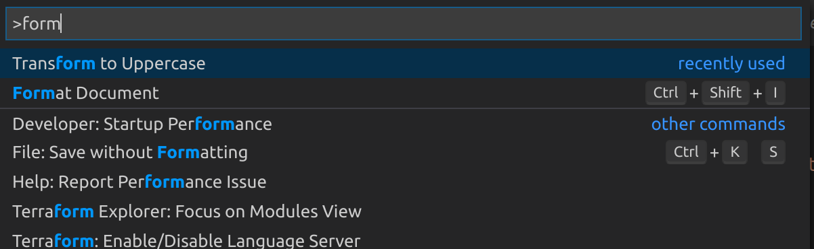

# Dev Productivity

## Use Docker and stop hearing "Works on my machine!"

Actual story:

- Me: wow, cool repo! so impress, much fancy.
- Me: clone repo
- Me: run repo
- Computer: `MissingRequirementError: Can't import 'OpenSSL' which is part of 'pyopenssl>=0.14'`
- Me (2 hours later): stackoverflow + 30 open tabs
- Me (2 days later): uninstalled python2 and python3 on my computer (true story)
- Me (3 days later): f\*\*\* this repo

The same can happen at work. After a few days/weeks of building something and installing various project-level and OS-level dependencies to get things to work, it can be extremely painful (if not impossible) to recall the steps that someone (maybe your colleague / your manager) needs to run to see your awesome work. If you've been in this situation before, you know that this is a waste of time.

It's much better to reduce entropy and start any project right by ensuring that whatever works on your machine will work on another machine (e.g. your colleague's laptop or the machines that you're deploying your software onto). **With Docker, you can ensure that in a few steps.**

Docker allows us to manage the following dependencies in a single place:

- OS dependencies (e.g. `gcc`, `curl`)
- Python runtime version (e.g. Python 3.8)
- CLI tools dependencies
- Project-level dependencies (e.g. `pandas`, `numpy`)

Sample template project: https://github.com/davified/docker-python-template

Further reading: https://www.thoughtworks.com/insights/blog/reproducible-work-environments-using-docker

## VS Code productivity tips (or "Know Your IDE")

The only keyboard shortcut you absolutely must remember from is `Ctrl+Shift+P` (Windows/Linux) or `⇧⌘P` (MacOS). This brings up Command Palette, where you can search for any actions. It does fuzzy searching so writing `emet` will find *E*xtract *MET*hod. It will also show you the associated keyboard shortcut, so you can gradually learn more shortcuts.

## Ensure reproducibility

(Work in progress)
