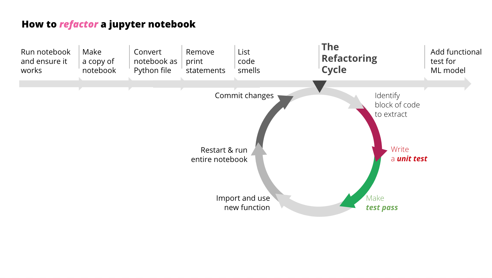

# How to refactor a Jupyter notebook

## What is "refactoring"

Refactoring is **changing code to make it easier to understand and modify without changing its observable behavior** (Adapted from Refactoring (2nd edition) - Martin Fowler)

Refactoring without tests is **hard**. And typically, when we write Jupyter notebooks, we usually just bang out code without writing tests.

Nonetheless, since this is the predicament which we find ourselves in, we need to find a way towards code that is unit-tested and properly abstracted, so that we can have a maintainable, readable and extensible codebase. So that we can remain productive even as we're confronted with new business requirements and new data.

### The refactoring process

**Before we start refactoring:**

- Ensure that notebooks when run from start to end
- Make a copy of the original notebook (for comparing the end result later)
  - This frees us up from any emotional attachment and allow us to ruthlessly clean up the code.
- Convert Jupyter notebook into a plain Python file
  - This will allow you to have all the benefits of using an IDE (e.g. autocomplete, intellisense, formatting, auto-renaming, linting, keyboard shortcuts, etc. For more details, check out this [tutorial](https://www.youtube.com/watch?v=KUvqDINDzFE&list=PLO9pkowc_99ZhP2yuPU8WCfFNYEx2IkwR&index=6))
  - Command: `jupyter nbconvert --to script mynotebook.ipynb`
- Remove print statements (e.g. `print(...)`, `df.head()`, `df.describe()`, `df.plot()`)
  - This removes noise and visual clutter, and makes the next step exponentially easier
- Read notebook and list [code smells](../README.md)
- Define refactoring boundary and add a characterisation test
  - This is arguably **the most important step**. Having a characterisation test will give you fast feedback because it can be run continuously as you refactor. It will tell you within seconds (or even milliseconds) if you've accidentally introduced an error or a bug.
  - Without the characterisation test, you would have to manually restart and rerun the entire Jupyter notebook - which is cumbersome and so 2019.

**The refactoring cycle:**
The instructions for how to run each step can be found in the [refactoring exercise](./refactoring-exercise.md)

- Identify a block of code that can be extracted into a pure function
- Write automated tests

   - Run the unit tests in [watch mode](./refactoring-exercise.md#getting-started)
   - Write a [unit test](../src/tests/test_preprocessing.py) for the code block
   - Create a [Python module](../src/preprocessing.py) and define a function. Move existing implementation from notebook into that function
   - Make the test pass

- In the notebook, replace original code block with the newly defined function
- Ensure characterisation tests are still passing
- [If possible] Refactor function some more
- Commit your changes
   - `git add .`
   - `git commit -m "your commit message"`
- **Rinse and repeat**

### Some tips

- When refactoring, don't change the program's observable behaviour. (Remember the [Two Hats](https://www.martinfowler.com/articles/workflowsOfRefactoring/#2hats))
- Keep tests in watch mode. Test continuously during each refactoring
  - "Testing after each change means that when I make a mistake, I only have a small change to consider in order to spot the error, which makes it far easier to find and fix." (Martin Fowler)
- Make small and frequent commits
- Don't try big bang refactorings. Refactoring isn’t an activity that’s separated from programming. We refactor as we go.
- When to refactor
  - "**Three strikes, then you refactor.** The first time you do something, you just do it. The second time you do something similar, you wince at the duplication, but you do the duplicate thing anyway. The third time you do something similar, you refactor." (Martin Fowler)

